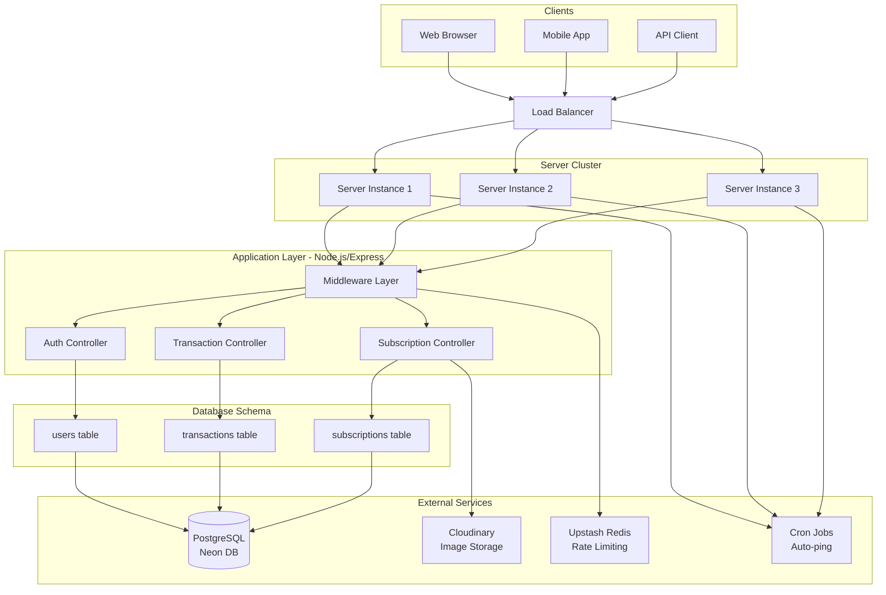
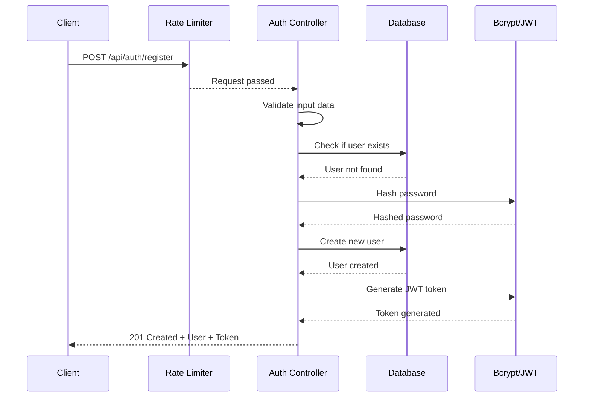
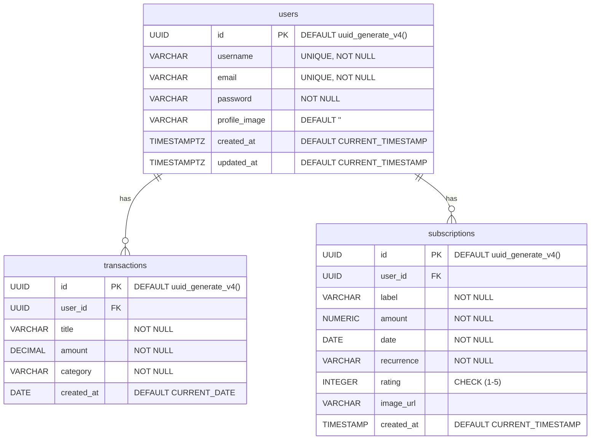

# 📊 MyWallet — API de Gestion Financière

**MyWallet** est une API RESTful conçue pour simplifier la gestion de vos finances personnelles.
Elle permet de **suivre vos transactions**, **gérer vos abonnements récurrents** et **analyser votre situation financière** grâce à des résumés clairs et automatisés.

---

## 🚀 Fonctionnalités

### 🔐 Authentification Sécurisée

* Inscription et connexion avec validation des données
* Authentification via **JWT (JSON Web Tokens)**
* Middleware de protection des routes
* Limitation des tentatives de connexion *(anti-brute-force)*

### 💰 Gestion des Transactions

* ➕ Création de transactions (revenus / dépenses)
* 📋 Liste complète des transactions
* 🗑️ Suppression de transactions
* 📊 Résumé financier : solde, revenus totaux, dépenses totales

### 🗕️ Gestion des Abonnements

* ➕ Ajout d’abonnements (Netflix, Spotify, etc.)
* 👀 Consultation et suppression des abonnements
* 🌟 Attribution d’une note (1 à 5 étoiles)
* 🖼️ Téléversement d’images via **Cloudinary**
* 📈 Résumé global : coût total et nombre d’abonnements

---

## 🛠️ Technologies Utilisées

| Domaine           | Technologie                        |
| ----------------- | ---------------------------------- |
| Backend           | Node.js, Express.js                |
| Base de données   | PostgreSQL (via **Neon**)          |
| Authentification  | JWT                                |
| Sécurité          | bcryptjs, CORS, validation serveur |
| Stockage d’images | Cloudinary                         |
| Documentation     | Swagger / OpenAPI                  |
| Rate Limiting     | Upstash Redis                      |
| Planification     | Cron Jobs                          |

---

## 🏗️ Architecture Globale


---

## 🔐 Flux d'Authentification



---

## 🗄️ Structure des Données



---


## 📡 Flux Complet des Requêtes API

```mermaid
flowchart TD
flowchart TD
    Start([Request Start]) --> RateLimit{Rate Limit<br/>Check}
    
    RateLimit -- "❌ Too Many Requests" --> Error429[429 Too Many Requests]
    
    RateLimit -- "✅ Within Limit" --> AuthCheck{Auth Required?}
    
    AuthCheck -- "Public Route" --> PublicRoute[Process Public Request]
    AuthCheck -- "Protected Route" --> VerifyToken{Verify JWT Token}
    
    VerifyToken -- "❌ Invalid/Expired" --> Error401[401 Unauthorized]
    
    VerifyToken -- "✅ Valid Token" --> ExtractUser[Extract User Data]
    ExtractUser --> ValidateData{Validate Request Data}
    
    ValidateData -- "❌ Invalid Data" --> Error400[400 Bad Request]
    
    ValidateData -- "✅ Valid Data" --> BusinessLogic[Business Logic]
    BusinessLogic --> DBOperation[Database Operation]
    DBOperation --> Response[Send Response]
    
    Response --> End([Request End])
    
    Error429 --> End
    Error401 --> End
    Error400 --> End
    
    PublicRoute --> ValidateDataPublic{Validate Public Data}
    ValidateDataPublic -- "✅ Valid" --> PublicBusiness[Public Business Logic]
    ValidateDataPublic -- "❌ Invalid" --> Error400
    PublicBusiness --> PublicDB[Public DB Operation]
    PublicDB --> PublicResponse[Send Public Response]
    PublicResponse --> End

```

---

## ⚙️ Installation et Démarrage

### 🔧 Prérequis

* Node.js **v18+**
* Compte **Neon PostgreSQL**
* Compte **Cloudinary**

### 📦 Installation

```bash
git clone https://github.com/Maxime015/MyWallet-Backend.git backend
cd backend
npm install
```

### 🧩 Configuration

Créer un fichier `.env` à la racine :

```env
# Serveur
PORT=3000
NODE_ENV=development

# Base de données
DATABASE_URL=votre_url_neon_postgresql

# JWT
JWT_SECRET=votre_secret_jwt

# Cloudinary
CLOUDINARY_CLOUD_NAME=votre_cloud_name
CLOUDINARY_API_KEY=votre_api_key
CLOUDINARY_API_SECRET=votre_api_secret

# Rate Limiting (Upstash Redis)
UPSTASH_REDIS_REST_URL=votre_url_redis
UPSTASH_REDIS_REST_TOKEN=votre_token_redis
```

### 🚀 Lancer le serveur

```bash
npm run dev
```

> 💡 La base de données est initialisée automatiquement au premier démarrage via `initDB()` dans `db.js`.

---

## 🗄️ Structure de la Base de Données

### 👥 Table `users`

| Champ         | Type         | Détails                             |
| ------------- | ------------ | ----------------------------------- |
| id            | UUID         | Clé primaire (`uuid_generate_v4()`) |
| username      | VARCHAR(255) | Unique, requis                      |
| email         | VARCHAR(255) | Unique, requis                      |
| password      | VARCHAR(255) | Haché avec bcrypt                   |
| profile_image | VARCHAR(255) | Défaut : chaîne vide                |
| created_at    | TIMESTAMPTZ  | Défaut : `CURRENT_TIMESTAMP`        |
| updated_at    | TIMESTAMPTZ  | Défaut : `CURRENT_TIMESTAMP`        |

---

### 💰 Table `transactions`

| Champ       | Type                                     | Détails                             |
| ----------- | ---------------------------------------- | ----------------------------------- |
| id          | UUID                                     | Clé primaire (`uuid_generate_v4()`) |
| user_id     | UUID                                     | Clé étrangère vers `users(id)`      |
| title       | VARCHAR(255)                             | Requis                              |
| amount      | DECIMAL(10,2)                            | Requis                              |
| category    | VARCHAR(255)                             | Requis                              |
| created_at  | DATE                                     | Défaut : `CURRENT_DATE`             |
| Contraintes | `ON DELETE CASCADE`, `ON UPDATE CASCADE` |                                     |

---

### 📅 Table `subscriptions`

| Champ       | Type                                     | Détails                             |
| ----------- | ---------------------------------------- | ----------------------------------- |
| id          | UUID                                     | Clé primaire (`uuid_generate_v4()`) |
| user_id     | UUID                                     | Clé étrangère vers `users(id)`      |
| label       | VARCHAR(255)                             | Requis                              |
| amount      | NUMERIC(10,2)                            | Requis                              |
| date        | DATE                                     | Requis                              |
| recurrence  | VARCHAR(50)                              | Requis                              |
| rating      | INTEGER                                  | Doit être entre 1 et 5              |
| image_url   | VARCHAR(255)                             | Optionnel                           |
| created_at  | TIMESTAMP                                | Défaut : `CURRENT_TIMESTAMP`        |
| Contraintes | `ON DELETE CASCADE`, `ON UPDATE CASCADE` |                                     |

---

## 🔒 Sécurité Intégrée

* Hachage des mots de passe avec **bcryptjs**
* Vérification avec `comparePassword()`
* Authentification **JWT**
* Validation côté serveur
* Protection **CORS**
* Rate Limiting via **Redis**

---

## 📚 Endpoints Principaux

### 🔐 Authentification

| Méthode | Endpoint             | Description             |
| ------- | -------------------- | ----------------------- |
| `POST`  | `/api/auth/register` | Inscription utilisateur |
| `POST`  | `/api/auth/login`    | Connexion utilisateur   |

### 💰 Transactions

| Méthode  | Endpoint                | Description                   |
| -------- | ----------------------- | ----------------------------- |
| `GET`    | `/api/transactions`     | Liste des transactions        |
| `POST`   | `/api/transactions`     | Création d’une transaction    |
| `DELETE` | `/api/transactions/:id` | Suppression d’une transaction |

### 📅 Abonnements

| Méthode  | Endpoint                 | Description                 |
| -------- | ------------------------ | --------------------------- |
| `GET`    | `/api/subscriptions`     | Liste des abonnements       |
| `POST`   | `/api/subscriptions`     | Création d’un abonnement    |
| `DELETE` | `/api/subscriptions/:id` | Suppression d’un abonnement |

---

## 🧠 Exemple d’utilisation

### Inscription utilisateur

```json
POST /api/auth/register
{
  "username": "alex",
  "email": "alex@example.com",
  "password": "motdepasse123"
}
```

### Ajout d’un abonnement

```json
POST /api/subscriptions
{
  "label": "Netflix",
  "amount": 15.99,
  "date": "2024-01-15",
  "recurrence": "monthly",
  "rating": 4,
  "image_url": "https://..."
}
```

---

## 📝 Licence

Projet sous licence **MIT**.
 